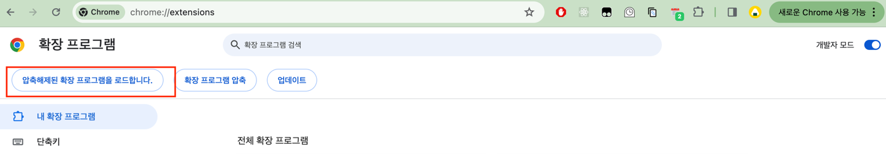

# NAVER WORKS Calendar Notifier

You can install this extension [here](https://chromewebstore.google.com/detail/naver-works-calendar-noti/bnbjjkhofaohmgeanhjafjaeclhbkpne)!

This extension sends notifications to you at your meeting schedule.

Experience seamless scheduling with the NAVER WORKS Calendar Notifier Chrome extension. Receive convenient Chrome notifications for your upcoming meetings directly. Simply click on the notification to effortlessly join your scheduled meetings without any hassle.

Key Features:

- Instant Chrome notifications for NAVER WORKS calendar schedules.
- Effortlessly join meetings with a single click from the notification.
- Stay organized and punctual with timely reminders for your appointments.

## How to build
```sh
make build
```
or
```sh
cd app
npm run build
```

Then, you can find bundle files in the `dist` directory.

## How to develop
1. Fix the code.
2. Build the app.
3. Load the app in Chrome (chrome://extensions/).

4. Test your code.
5. Publish!
